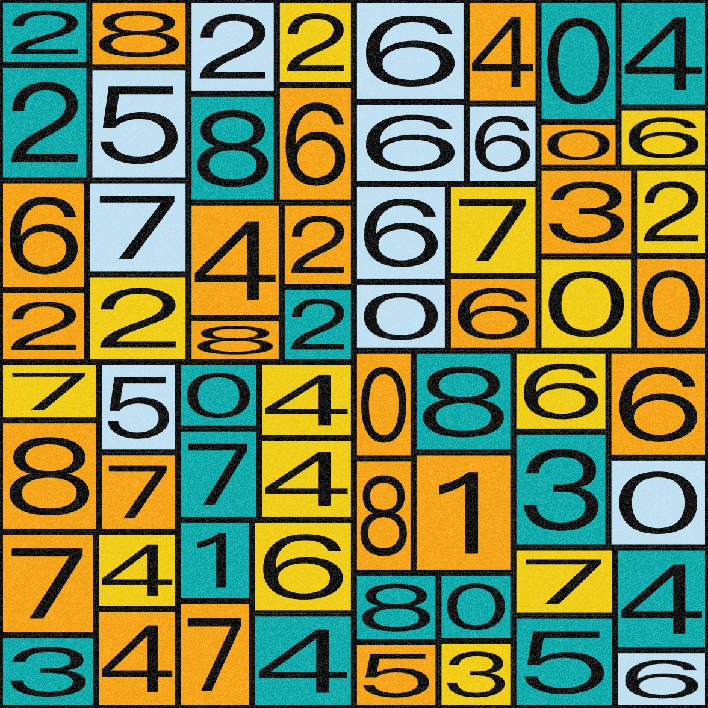

# OpenProcessing源码分析

## OpenProcessing网址

[https://openprocessing.org/](https://openprocessing.org/)

## 源码分析

|  编号   | 预览 |源代码地址  | 源码分析文章地址 ｜
|  ----  | ----  | ----  | ----  |
| 1250878  |  | [https://openprocessing.org/sketch/1250878](https://openprocessing.org/sketch/1250878) | [有趣的Processing"区块链"鸟-源码解析](https://mp.weixin.qq.com/s/DDVzqSXaK9Bb3HftL1ccBA) |
| 1286327  |  | [https://openprocessing.org/sketch/1286327](https://openprocessing.org/sketch/1286327) | 1. [生成艺术之递归-小白也能看的懂系列](https://mp.weixin.qq.com/s/iuTBu52Hmkimrehfo8tcng)   2. [生成艺术之缓动的奥秘-小白也能看的懂系列](https://mp.weixin.qq.com/s/gKtOj_zhh14alOED7tSSMQ) |